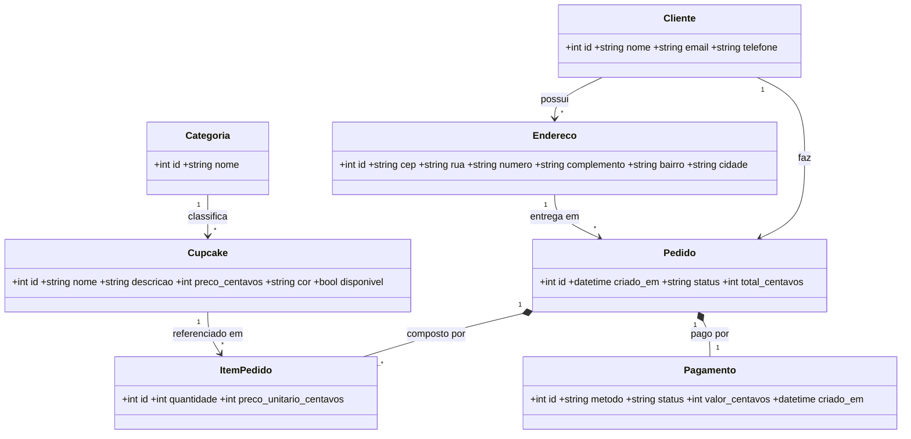
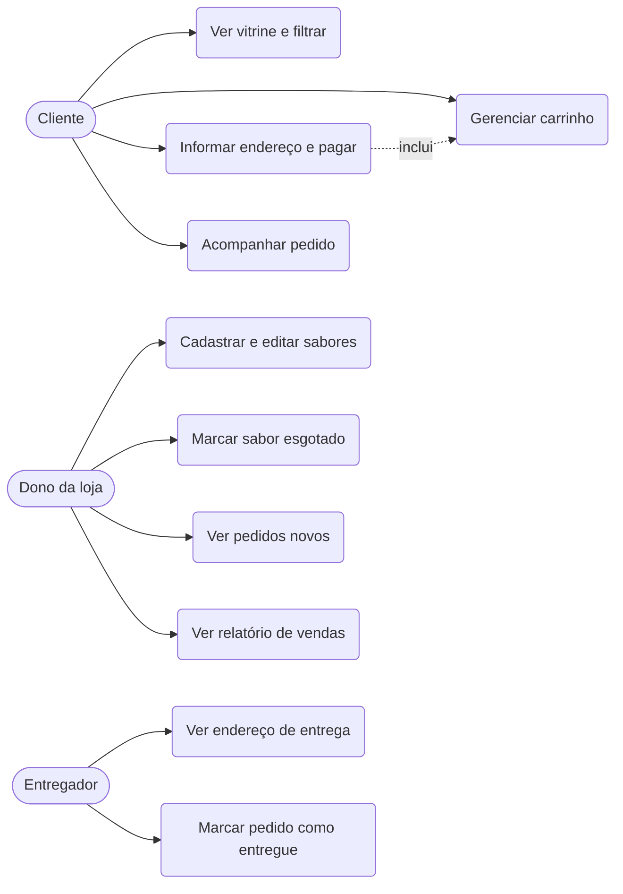
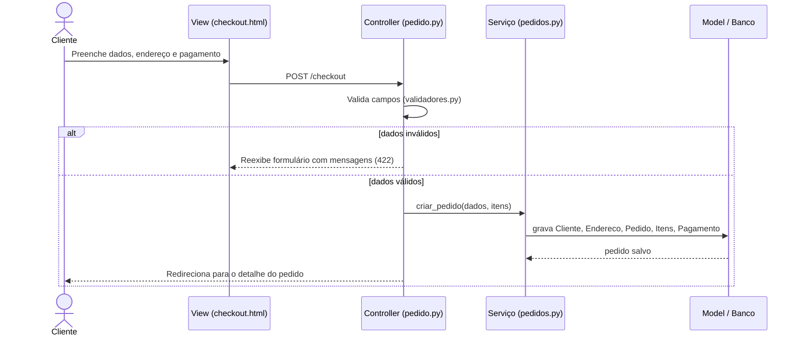
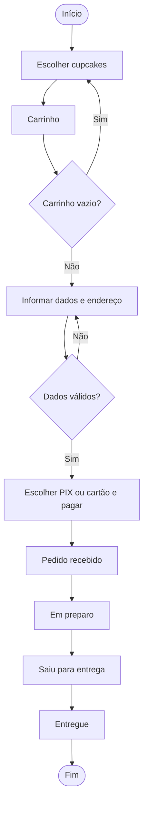

# 2. Modelagem UML

## Diagrama de classes

```mermaid
classDiagram
    class Categoria { +int id +string nome }
    class Cupcake { +int id +string nome +string descricao +int preco_centavos +string cor +bool disponivel }
    class Cliente { +int id +string nome +string email +string telefone }
    class Endereco { +int id +string cep +string rua +string numero +string complemento +string bairro +string cidade }
    class Pedido { +int id +datetime criado_em +string status +int total_centavos }
    class ItemPedido { +int id +int quantidade +int preco_unitario_centavos }
    class Pagamento { +int id +string metodo +string status +int valor_centavos +datetime criado_em }
    Categoria "1" --> "*" Cupcake : classifica
    Cliente "1" --> "*" Endereco : possui
    Cliente "1" --> "*" Pedido : faz
    Endereco "1" --> "*" Pedido : entrega em
    Pedido "1" *-- "1..*" ItemPedido : composto por
    Cupcake "1" --> "*" ItemPedido : referenciado em
    Pedido "1" *-- "1" Pagamento : pago por
```

## Casos de uso

```mermaid
flowchart LR
    C([Cliente]) --> UC1(Ver vitrine e filtrar)
    C --> UC2(Gerenciar carrinho)
    C --> UC3(Informar endereço e pagar)
    C --> UC4(Acompanhar pedido)
    D([Dono da loja]) --> UC5(Cadastrar e editar sabores)
    D --> UC6(Marcar sabor esgotado)
    D --> UC7(Ver pedidos novos)
    D --> UC8(Ver relatório de vendas)
    E([Entregador]) --> UC9(Ver endereço de entrega)
    E --> UC10(Marcar pedido como entregue)
    UC3 -.inclui.-> UC2
```

## Diagrama de sequência: compra

```mermaid
sequenceDiagram
    actor Cliente
    participant V as View (checkout.html)
    participant C as Controller (pedido.py)
    participant S as Serviço (pedidos.py)
    participant M as Model / Banco
    Cliente->>V: Preenche dados, endereço e pagamento
    V->>C: POST /checkout
    C->>C: Valida campos (validadores.py)
    alt dados inválidos
        C-->>V: Reexibe formulário com mensagens (422)
    else dados válidos
        C->>S: criar_pedido(dados, itens)
        S->>M: grava Cliente, Endereco, Pedido, Itens, Pagamento
        M-->>S: pedido salvo
        C-->>Cliente: Redireciona para o detalhe do pedido
    end
```

## Diagrama de atividades: fluxo do pedido

```mermaid
flowchart TD
    A([Início]) --> B[Escolher cupcakes]
    B --> C[Carrinho]
    C --> D{Carrinho vazio?}
    D -- Sim --> B
    D -- Não --> E[Informar dados e endereço]
    E --> F{Dados válidos?}
    F -- Não --> E
    F -- Sim --> G[Escolher PIX ou cartão e pagar]
    G --> H[Pedido recebido]
    H --> I[Em preparo]
    I --> J[Saiu para entrega]
    J --> K[Entregue]
    K --> L([Fim])
```
